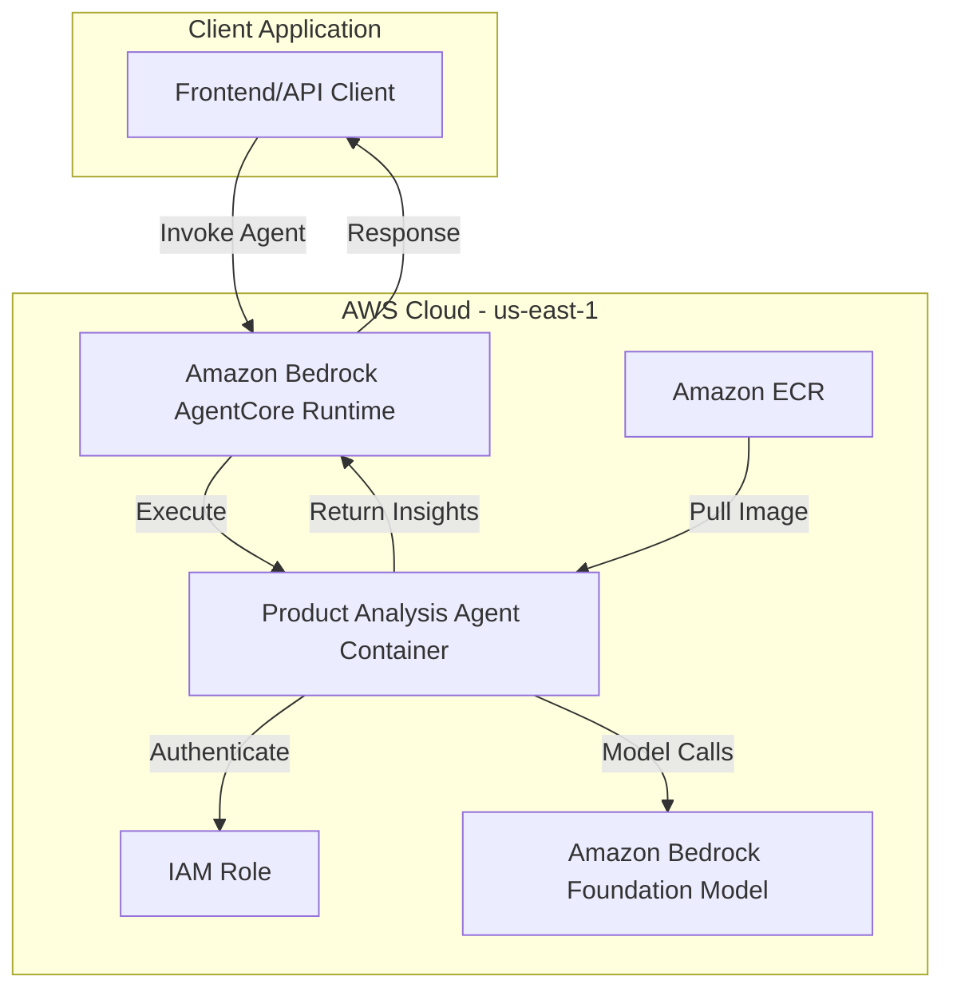
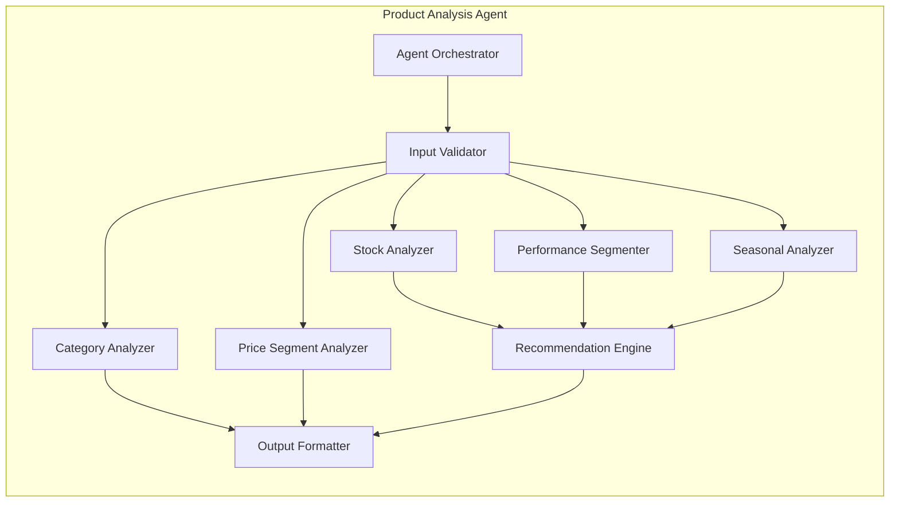

# Design Document: Product Analysis Strands Agent

## Overview

The Product Analysis Strands Agent is a Python-based AI agent deployed on Amazon Bedrock AgentCore Runtime that analyzes product data to generate actionable insights for campaign management. The agent implements a model-driven architecture, leveraging AI capabilities for planning, reasoning, tool calling, and self-reflection to autonomously analyze product performance, stock levels, seasonal relevance, and generate recommendations.

The agent processes product catalogs, order history, and climate data to produce comprehensive insights including:
- Product segmentation (Star, Rising, Steady, Underperformer)
- Stock analysis (Critical, Healthy, Excess)
- Seasonal relevance scoring
- Category and price segment analytics
- Actionable recommendations (PROMOTE, FEATURE, DISCOUNT, CLEARANCE, etc.)

The implementation follows AWS best practices for Bedrock AgentCore deployment, using the Strands Agent framework for model-driven autonomous execution.

## Architecture

### High-Level Architecture



### Component Architecture



### Deployment Architecture

The agent is deployed as a containerized application on Amazon Bedrock AgentCore Runtime:

1. **Development Environment**: Python code developed in uv virtual environment (.venv)
2. **Container Build**: Agent packaged as Docker container
3. **ECR Storage**: Container image stored in Amazon ECR
4. **AgentCore Deployment**: Container deployed to Bedrock AgentCore Runtime
5. **Invocation**: Agent invoked via AWS SDK with JSON input/output

### Model-Driven Approach

The agent uses AI foundation models for:
- **Planning**: Determining analysis workflow based on input data characteristics
- **Reasoning**: Making segmentation decisions based on business rules and data patterns
- **Tool Calling**: Executing analysis functions (stock calculation, segmentation, etc.)
- **Self-Reflection**: Validating output quality and completeness

## Components and Interfaces

### 1. Agent Orchestrator

**Responsibility**: Coordinates the overall analysis workflow using AI model planning capabilities.

**Interface**:
```python
class AgentOrchestrator:
    def execute(self, input_data: dict) -> dict:
        """
        Main entry point for agent execution.
        
        Args:
            input_data: Dictionary containing tenantId, products, orderHistory, 
                       currentMonth, climateData
        
        Returns:
            ProductInsightJSON with all analysis results
        """
        pass
```

**Behavior**:
- Receives input data
- Plans analysis workflow
- Coordinates execution of analysis components
- Aggregates results into final output
- Uses AI model for workflow planning and coordination

### 2. Input Validator

**Responsibility**: Validates input data structure and required fields.

**Interface**:
```python
class InputValidator:
    def validate(self, input_data: dict) -> tuple[bool, str]:
        """
        Validates input data structure.
        
        Args:
            input_data: Raw input dictionary
        
        Returns:
            Tuple of (is_valid, error_message)
        """
        pass
```

**Validation Rules**:
- tenantId must be present and non-empty string
- products must be array with at least one product
- Each product must have: productId, productName, category, stock, last30DaysSales, cost, basePrice, lifecycleStage, trendScore
- orderHistory must be array (can be empty)
- currentMonth must be integer 1-12
- climateData must be object (can be empty)

### 3. Stock Analyzer

**Responsibility**: Calculates stock metrics and classifies stock segments.

**Interface**:
```python
class StockAnalyzer:
    def analyze(self, products: list, order_history: list) -> dict:
        """
        Analyzes stock levels for all products.
        
        Args:
            products: List of product dictionaries
            order_history: List of order dictionaries
        
        Returns:
            Dictionary mapping productId to stock metrics:
            {
                productId: {
                    dailySalesRate: float,
                    stockDays: float,
                    stockSegment: str,  # Critical, Healthy, Excess
                    inventoryPressure: bool
                }
            }
        """
        pass
    
    def calculate_daily_sales_rate(self, product_id: str, order_history: list) -> float:
        """Calculate average daily sales over 90 days."""
        pass
    
    def calculate_stock_days(self, stock: int, daily_sales_rate: float) -> float:
        """Calculate days of inventory remaining."""
        pass
    
    def classify_stock_segment(self, stock_days: float) -> str:
        """Classify as Critical (<15), Healthy (15-60), or Excess (>60)."""
        pass
```

**Algorithm**:
1. Aggregate sales by productId from orderHistory (last 90 days)
2. Calculate dailySalesRate = totalSales / 90
3. Calculate stockDays = currentStock / dailySalesRate (999 if dailySalesRate == 0)
4. Classify: Critical (<15), Healthy (15-60), Excess (>60)
5. Set inventoryPressure = True if stockDays > 60

### 4. Performance Segmenter

**Responsibility**: Classifies products into performance segments and calculates margin health.

**Interface**:
```python
class PerformanceSegmenter:
    def segment(self, products: list, stock_metrics: dict) -> dict:
        """
        Segments products by performance.
        
        Args:
            products: List of product dictionaries
            stock_metrics: Stock analysis results from StockAnalyzer
        
        Returns:
            Dictionary mapping productId to performance metrics:
            {
                productId: {
                    performanceSegment: str,  # Star, Rising, Steady, Underperformer
                    marginHealth: str,  # EXCELLENT, GOOD, MODERATE, POOR
                    priceSegment: str,  # BUDGET, MID, PREMIUM
                    margin: float
                }
            }
        """
        pass
    
    def classify_performance(self, product: dict, stock_days: float) -> str:
        """Classify performance segment."""
        pass
    
    def calculate_margin_health(self, cost: float, base_price: float) -> tuple[float, str]:
        """Calculate margin percentage and health classification."""
        pass
    
    def classify_price_segment(self, base_price: float) -> str:
        """Classify price segment."""
        pass
```

**Algorithm**:
1. **Performance Segment**:
   - Rising: lifecycleStage == "NEW" AND trendScore > 85
   - Star: trendScore > 80 AND stockDays < 30
   - Steady: 60 <= trendScore <= 80 AND stockDays < 60
   - Underperformer: otherwise

2. **Margin Health**:
   - margin = ((basePrice - cost) / basePrice) * 100
   - EXCELLENT: margin > 60%
   - GOOD: 40% < margin <= 60%
   - MODERATE: 25% < margin <= 40%
   - POOR: margin <= 25%

3. **Price Segment**:
   - BUDGET: basePrice <= 200
   - MID: 200 < basePrice <= 500
   - PREMIUM: basePrice > 500

### 5. Seasonal Analyzer

**Responsibility**: Determines seasonal relevance and climate matching.

**Interface**:
```python
class SeasonalAnalyzer:
    def analyze(self, products: list, current_month: int, climate_data: dict) -> dict:
        """
        Analyzes seasonal relevance for products.
        
        Args:
            products: List of product dictionaries
            current_month: Current month (1-12)
            climate_data: Climate data by city
        
        Returns:
            Dictionary mapping productId to seasonal metrics:
            {
                productId: {
                    seasonMatch: bool,
                    climateMatch: list[str],
                    matchingCities: list[str],
                    seasonalRelevance: str  # HIGH, MEDIUM, LOW
                }
            }
        """
        pass
    
    def get_current_season(self, month: int) -> str:
        """Determine season from month."""
        pass
    
    def check_season_match(self, product: dict, current_season: str) -> bool:
        """Check if product season matches current season."""
        pass
    
    def check_climate_rules(self, product: dict, climate_data: dict) -> tuple[list, list]:
        """Check climate rules and return matching rule types and cities."""
        pass
```

**Algorithm**:
1. **Season Determination**:
   - SPRING: months 3-5
   - SUMMER: months 6-8
   - FALL: months 9-11
   - WINTER: months 12, 1-2

2. **Season Match**:
   - True if product.isSeasonal == False
   - True if product.seasonCode == currentSeason
   - False otherwise

3. **Climate Matching**:
   - Evaluate each seasonalityRule against climateData
   - Rule types: HIGH_HUMIDITY, LOW_TEMP, HIGH_RAINFALL, SEASON_TAG
   - Track matching cities

4. **Seasonal Relevance**:
   - HIGH: seasonMatch == True AND climateMatch.length > 0
   - MEDIUM: seasonMatch == True AND climateMatch.length == 0
   - LOW: seasonMatch == False

### 6. Category Analyzer

**Responsibility**: Aggregates metrics by product category.

**Interface**:
```python
class CategoryAnalyzer:
    def analyze(self, products: list, performance_metrics: dict, stock_metrics: dict) -> dict:
        """
        Analyzes performance by category.
        
        Args:
            products: List of product dictionaries
            performance_metrics: Performance segmentation results
            stock_metrics: Stock analysis results
        
        Returns:
            Dictionary mapping category to aggregated metrics:
            {
                category: {
                    totalProducts: int,
                    avgTrendScore: float,
                    totalStock: int,
                    avgStockDays: float,
                    performanceRating: str,  # STRONG, MODERATE, WEAK
                    topPerformers: int,
                    underperformers: int
                }
            }
        """
        pass
```

**Algorithm**:
1. Group products by category
2. For each category:
   - Count totalProducts
   - Calculate avgTrendScore
   - Sum totalStock
   - Calculate avgStockDays
   - Count topPerformers (Star or Rising)
   - Count underperformers
3. Determine performanceRating:
   - STRONG: avgTrendScore > 80
   - MODERATE: 65 < avgTrendScore <= 80
   - WEAK: avgTrendScore <= 65

### 7. Price Segment Analyzer

**Responsibility**: Aggregates metrics by price segment.

**Interface**:
```python
class PriceSegmentAnalyzer:
    def analyze(self, products: list, performance_metrics: dict, stock_metrics: dict) -> dict:
        """
        Analyzes performance by price segment.
        
        Args:
            products: List of product dictionaries
            performance_metrics: Performance segmentation results
            stock_metrics: Stock analysis results
        
        Returns:
            Dictionary with price segment analysis:
            {
                BUDGET: {
                    priceRange: str,
                    productCount: int,
                    avgTrendScore: float,
                    stockHealth: str  # GOOD, MODERATE, POOR
                },
                MID: {...},
                PREMIUM: {...}
            }
        """
        pass
```

**Algorithm**:
1. Group products by priceSegment
2. For each segment:
   - Count productCount
   - Calculate avgTrendScore
   - Calculate proportion of Healthy stock products
3. Determine stockHealth:
   - GOOD: >70% Healthy
   - MODERATE: 40-70% Healthy
   - POOR: <40% Healthy

### 8. Recommendation Engine

**Responsibility**: Generates recommended actions based on all analysis results.

**Interface**:
```python
class RecommendationEngine:
    def recommend(self, product: dict, performance_metrics: dict, 
                  stock_metrics: dict, seasonal_metrics: dict) -> tuple[str, str]:
        """
        Generates recommended action and urgency level.
        
        Args:
            product: Product dictionary
            performance_metrics: Performance segmentation for product
            stock_metrics: Stock analysis for product
            seasonal_metrics: Seasonal analysis for product
        
        Returns:
            Tuple of (recommendedAction, urgencyLevel)
        """
        pass
```

**Decision Logic** (priority order):
1. Star + Critical stock → RESTOCK, CRITICAL
2. Rising → FEATURE, HIGH
3. Star + Healthy stock → PROMOTE, HIGH
4. HIGH seasonal relevance + not Critical → SEASONAL_PUSH, MEDIUM
5. Excess + DECLINING → CLEARANCE, CRITICAL
6. Excess + MODERATE margin → BUNDLE, HIGH
7. Underperformer → DISCOUNT, MEDIUM
8. Default → MAINTAIN, LOW

### 9. Output Formatter

**Responsibility**: Formats analysis results into ProductInsightJSON structure.

**Interface**:
```python
class OutputFormatter:
    def format(self, products: list, all_metrics: dict) -> dict:
        """
        Formats all analysis results into final output structure.
        
        Args:
            products: List of product dictionaries
            all_metrics: Combined metrics from all analyzers
        
        Returns:
            ProductInsightJSON dictionary with:
            - heroProducts (top 10 Star/Rising by trendScore)
            - slowMovers (top 15 Excess/Underperformer by stockDays)
            - newProducts (all NEW by trendScore)
            - seasonalProducts (top 10 HIGH relevance)
            - categoryInsights
            - priceSegmentAnalysis
            - inventorySummary
        """
        pass
    
    def calculate_inventory_summary(self, products: list, stock_metrics: dict) -> dict:
        """Calculate overall inventory metrics."""
        pass
```

## Data Models

### Input Schema

```python
{
    "tenantId": str,  # Tenant identifier
    "products": [
        {
            "productId": str,
            "productName": str,
            "category": str,
            "subcategory": str,
            "brand": str,
            "season": str,  # "all", "winter", "summer", "spring", "autumn"
            "isSeasonal": bool,
            "seasonCode": str,  # "all", "WINTER", "SUMMER", "SPRING", "FALL"
            "stock": int,
            "currentStock": int,
            "last30DaysSales": int,
            "cost": float,
            "unitCost": float,
            "basePrice": float,
            "unitPrice": float,
            "lifecycleStage": str,  # "NEW", "GROWING", "MATURE", "DECLINING"
            "trendScore": int,  # 0-100
            "tags": [str],
            "seasonalityRules": [
                {
                    "ruleType": str,  # "HIGH_HUMIDITY", "LOW_TEMP", "HIGH_RAINFALL", "SEASON_TAG"
                    "threshold": float,
                    "thresholdText": str
                }
            ]
        }
    ],
    "orderHistory": [
        {
            "orderId": str,
            "orderDate": str,
            "items": [
                {
                    "productId": str,
                    "quantity": int
                }
            ]
        }
    ],
    "currentMonth": int,  # 1-12
    "climateData": {
        "cityName": {
            "humidityPct": float,
            "avgTempC": float,
            "rainfallMm": float,
            "seasonTag": str
        }
    }
}
```

### Output Schema (ProductInsightJSON)

```python
{
    "heroProducts": [
        {
            "productId": str,
            "productName": str,
            "category": str,
            "brand": str,
            "performanceSegment": str,
            "stockSegment": str,
            "lifecycleStage": str,
            "trendScore": int,
            "stockDays": float,
            "dailySalesRate": float,
            "inventoryPressure": bool,
            "seasonalRelevance": str,
            "seasonMatch": bool,
            "priceSegment": str,
            "marginHealth": str,
            "recommendedAction": str,
            "urgencyLevel": str
        }
    ],
    "slowMovers": [...],  # Same structure as heroProducts
    "newProducts": [...],  # Same structure as heroProducts
    "seasonalProducts": [
        {
            "productId": str,
            "productName": str,
            "seasonalRelevance": str,
            "climateMatch": [str],
            "matchingCities": [str],
            "recommendedAction": str
        }
    ],
    "categoryInsights": {
        "categoryName": {
            "totalProducts": int,
            "avgTrendScore": float,
            "totalStock": int,
            "avgStockDays": float,
            "performanceRating": str,
            "topPerformers": int,
            "underperformers": int
        }
    },
    "priceSegmentAnalysis": {
        "BUDGET": {
            "priceRange": str,
            "productCount": int,
            "avgTrendScore": float,
            "stockHealth": str
        },
        "MID": {...},
        "PREMIUM": {...}
    },
    "inventorySummary": {
        "totalProducts": int,
        "totalStockValue": float,
        "criticalStockProducts": int,
        "excessStockProducts": int,
        "healthyStockProducts": int,
        "avgStockDays": float,
        "inventoryTurnoverRate": float
    }
}
```

### Internal Data Structures

**StockMetrics**:
```python
{
    "productId": {
        "dailySalesRate": float,
        "stockDays": float,
        "stockSegment": str,
        "inventoryPressure": bool
    }
}
```

**PerformanceMetrics**:
```python
{
    "productId": {
        "performanceSegment": str,
        "marginHealth": str,
        "priceSegment": str,
        "margin": float
    }
}
```

**SeasonalMetrics**:
```python
{
    "productId": {
        "seasonMatch": bool,
        "climateMatch": [str],
        "matchingCities": [str],
        "seasonalRelevance": str
    }
}
```

**RecommendationMetrics**:
```python
{
    "productId": {
        "recommendedAction": str,
        "urgencyLevel": str
    }
}
```


## Correctness Properties

A property is a characteristic or behavior that should hold true across all valid executions of a system—essentially, a formal statement about what the system should do. Properties serve as the bridge between human-readable specifications and machine-verifiable correctness guarantees.

### Property 1: Stock Analysis Calculation

*For any* product with order history, the agent should calculate dailySalesRate as the sum of quantities sold for that product divided by 90, and stockDays as currentStock divided by dailySalesRate (or 999 if dailySalesRate is zero).

**Validates: Requirements 1.2, 1.3, 7.1, 7.2, 7.3**

### Property 2: Stock Segment Classification

*For any* product with calculated stockDays, the agent should classify stockSegment as "Critical" when stockDays < 15, "Healthy" when 15 <= stockDays <= 60, and "Excess" when stockDays > 60.

**Validates: Requirements 1.5, 7.4, 7.5, 7.6**

### Property 3: Inventory Pressure Flag

*For any* product, when stockDays is greater than 60, the agent should set inventoryPressure to true, otherwise false.

**Validates: Requirements 7.7**

### Property 4: Performance Segment Classification

*For any* product with trendScore, lifecycleStage, and stockDays, the agent should classify performanceSegment as "Rising" when lifecycleStage is "NEW" and trendScore > 85, "Star" when trendScore > 80 and stockDays < 30, "Steady" when 60 <= trendScore <= 80 and stockDays < 60, and "Underperformer" otherwise.

**Validates: Requirements 1.4, 8.1, 8.2, 8.3, 8.4**

### Property 5: Margin Health Calculation

*For any* product with cost and basePrice, the agent should calculate margin as ((basePrice - cost) / basePrice) * 100, and classify marginHealth as "EXCELLENT" when margin > 60, "GOOD" when 40 < margin <= 60, "MODERATE" when 25 < margin <= 40, and "POOR" when margin <= 25.

**Validates: Requirements 1.7, 8.5, 8.6, 8.7, 8.8, 8.9**

### Property 6: Price Segment Classification

*For any* product with basePrice, the agent should classify priceSegment as "BUDGET" when basePrice <= 200, "MID" when 200 < basePrice <= 500, and "PREMIUM" when basePrice > 500.

**Validates: Requirements 1.8, 13.1, 13.2, 13.3**

### Property 7: Season Determination

*For any* month value (1-12), the agent should determine the season as "SPRING" for months 3-5, "SUMMER" for months 6-8, "FALL" for months 9-11, and "WINTER" for months 12, 1-2.

**Validates: Requirements 9.1**

### Property 8: Seasonal Relevance Determination

*For any* product with seasonCode, isSeasonal flag, and climate rule matches, the agent should set seasonMatch to true when isSeasonal is false or seasonCode matches current season, and set seasonalRelevance to "HIGH" when seasonMatch is true and climate rules match, "MEDIUM" when seasonMatch is true with no climate matches, and "LOW" when seasonMatch is false.

**Validates: Requirements 1.6, 9.2, 9.3, 9.4, 9.6, 9.7, 9.8**

### Property 9: Climate Rules Evaluation

*For any* product with seasonalityRules and climateData, the agent should evaluate each rule against the climate data and return matching rule types and cities where conditions are met (HIGH_HUMIDITY, LOW_TEMP, HIGH_RAINFALL, SEASON_TAG).

**Validates: Requirements 9.5**

### Property 10: Recommendation Generation

*For any* product with performanceSegment, stockSegment, seasonalRelevance, lifecycleStage, and marginHealth, the agent should generate recommendedAction following the priority logic: RESTOCK (Star + Critical), FEATURE (Rising), PROMOTE (Star + Healthy), SEASONAL_PUSH (HIGH relevance + not Critical), CLEARANCE (Excess + DECLINING), BUNDLE (Excess + MODERATE margin), DISCOUNT (Underperformer), or MAINTAIN (default).

**Validates: Requirements 1.9, 10.1, 10.2, 10.3, 10.4, 10.5, 10.6, 10.7, 10.8**

### Property 11: Output Structure Validation

*For any* valid input, the agent should produce output containing all required fields: heroProducts array, slowMovers array, newProducts array, seasonalProducts array, categoryInsights object, priceSegmentAnalysis object, and inventorySummary object, each with their specified sub-fields.

**Validates: Requirements 1.10, 11.5, 11.6, 11.7**

### Property 12: Hero Products Segmentation

*For any* set of analyzed products, the heroProducts array should contain only products with performanceSegment "Star" or "Rising", sorted by trendScore in descending order, limited to top 10.

**Validates: Requirements 11.1**

### Property 13: Slow Movers Segmentation

*For any* set of analyzed products, the slowMovers array should contain only products with stockSegment "Excess" or performanceSegment "Underperformer", sorted by stockDays in descending order, limited to top 15.

**Validates: Requirements 11.2**

### Property 14: New Products Segmentation

*For any* set of analyzed products, the newProducts array should contain all products with lifecycleStage "NEW", sorted by trendScore in descending order.

**Validates: Requirements 11.3**

### Property 15: Seasonal Products Segmentation

*For any* set of analyzed products, the seasonalProducts array should contain only products with seasonalRelevance "HIGH", limited to top 10.

**Validates: Requirements 11.4**

### Property 16: Category Analysis Aggregation

*For any* set of products grouped by category, the agent should calculate totalProducts count, avgTrendScore, totalStock, avgStockDays, topPerformers count (Star or Rising), underperformers count, and performanceRating as "STRONG" when avgTrendScore > 80, "MODERATE" when 65 < avgTrendScore <= 80, and "WEAK" when avgTrendScore <= 65.

**Validates: Requirements 12.1, 12.2, 12.3, 12.4, 12.5, 12.6, 12.7, 12.8, 12.9**

### Property 17: Price Segment Analysis Aggregation

*For any* set of products grouped by priceSegment, the agent should calculate productCount, avgTrendScore, and stockHealth as "GOOD" when >70% have Healthy stock, "MODERATE" when 40-70% have Healthy stock, and "POOR" when <40% have Healthy stock.

**Validates: Requirements 13.4, 13.5, 13.6, 13.7, 13.8, 13.9**

### Property 18: Inventory Summary Calculation

*For any* set of products, the agent should calculate totalProducts count, totalStockValue (sum of stock * cost), criticalStockProducts count, excessStockProducts count, healthyStockProducts count, avgStockDays, and inventoryTurnoverRate as 365 / avgStockDays.

**Validates: Requirements 14.1, 14.2, 14.3, 14.4, 14.5, 14.6, 14.7**

### Property 19: Input Validation

*For any* input data, the agent should validate that tenantId, products array, orderHistory array, currentMonth, and climateData are present, and return a descriptive error message if any required field is missing.

**Validates: Requirements 6.1, 6.2, 6.3, 6.4, 6.5, 6.6, 6.7**

## Error Handling

### Input Validation Errors

**Missing Required Fields**:
- Error: "Missing required field: {fieldName}"
- HTTP Status: 400 Bad Request
- Action: Return error immediately without processing

**Invalid Data Types**:
- Error: "Invalid data type for {fieldName}: expected {expectedType}, got {actualType}"
- HTTP Status: 400 Bad Request
- Action: Return error immediately without processing

**Invalid Month Value**:
- Error: "Invalid currentMonth: must be between 1 and 12, got {value}"
- HTTP Status: 400 Bad Request
- Action: Return error immediately without processing

**Empty Products Array**:
- Error: "Products array cannot be empty"
- HTTP Status: 400 Bad Request
- Action: Return error immediately without processing

### Processing Errors

**Division by Zero in Stock Calculation**:
- Behavior: Set stockDays to 999 (handled gracefully, not an error)
- No error thrown

**Missing Product Fields**:
- Error: "Product {productId} missing required field: {fieldName}"
- HTTP Status: 400 Bad Request
- Action: Return error with specific product identified

**Invalid Enum Values**:
- Error: "Invalid {fieldName} value for product {productId}: {value}"
- HTTP Status: 400 Bad Request
- Action: Return error with specific product and field identified

### AWS Service Errors

**Bedrock Model Invocation Failure**:
- Error: "Failed to invoke AI model: {errorMessage}"
- HTTP Status: 503 Service Unavailable
- Action: Log error, return service unavailable response

**IAM Permission Errors**:
- Error: "Insufficient permissions: {errorMessage}"
- HTTP Status: 403 Forbidden
- Action: Log error, return forbidden response

**Timeout Errors**:
- Error: "Request timeout: processing exceeded maximum duration"
- HTTP Status: 504 Gateway Timeout
- Action: Log error, return timeout response

### Error Response Format

All errors should be returned in a consistent JSON format:

```python
{
    "error": {
        "code": str,  # Error code (e.g., "MISSING_FIELD", "INVALID_TYPE")
        "message": str,  # Human-readable error message
        "field": str,  # Optional: specific field that caused error
        "details": dict  # Optional: additional error context
    }
}
```

## Testing Strategy

### Dual Testing Approach

The testing strategy employs both unit tests and property-based tests to ensure comprehensive coverage:

- **Unit Tests**: Verify specific examples, edge cases, and error conditions
- **Property Tests**: Verify universal properties across all inputs through randomization

Both testing approaches are complementary and necessary for comprehensive validation.

### Unit Testing

Unit tests focus on:
- **Specific Examples**: Concrete test cases demonstrating correct behavior (e.g., Star product with specific metrics)
- **Edge Cases**: Boundary conditions (e.g., stockDays exactly 15, trendScore exactly 80, zero sales)
- **Error Conditions**: Invalid inputs, missing fields, malformed data
- **Integration Points**: Component interactions, data flow between analyzers

**Example Unit Tests**:
```python
def test_star_product_classification():
    """Test that a product with trendScore=85 and stockDays=20 is classified as Star."""
    product = {"trendScore": 85, "lifecycleStage": "MATURE"}
    stock_days = 20
    result = classify_performance(product, stock_days)
    assert result == "Star"

def test_zero_sales_edge_case():
    """Test that products with zero sales get stockDays=999."""
    product = {"stock": 100}
    order_history = []
    result = calculate_stock_days(product, order_history)
    assert result == 999

def test_missing_tenant_id_error():
    """Test that missing tenantId returns appropriate error."""
    input_data = {"products": [], "orderHistory": []}
    result = validate_input(input_data)
    assert result["error"]["code"] == "MISSING_FIELD"
    assert "tenantId" in result["error"]["message"]
```

### Property-Based Testing

Property tests verify universal properties across randomized inputs. Each property test should:
- Run minimum 100 iterations (due to randomization)
- Generate diverse, valid test data
- Reference the design document property
- Use tag format: **Feature: product-analysis-strands-agent, Property {number}: {property_text}**

**Property Testing Library**: Use `hypothesis` for Python property-based testing.

**Example Property Tests**:
```python
from hypothesis import given, strategies as st

@given(st.integers(min_value=0, max_value=1000), 
       st.floats(min_value=0.1, max_value=100))
def test_property_stock_days_calculation(stock, daily_sales_rate):
    """
    Feature: product-analysis-strands-agent
    Property 1: Stock Analysis Calculation
    
    For any product with positive stock and daily sales rate,
    stockDays should equal stock / dailySalesRate.
    """
    result = calculate_stock_days(stock, daily_sales_rate)
    expected = stock / daily_sales_rate
    assert abs(result - expected) < 0.01  # Float comparison tolerance

@given(st.floats(min_value=0, max_value=200))
def test_property_stock_segment_classification(stock_days):
    """
    Feature: product-analysis-strands-agent
    Property 2: Stock Segment Classification
    
    For any stockDays value, classification should follow thresholds:
    <15: Critical, 15-60: Healthy, >60: Excess.
    """
    result = classify_stock_segment(stock_days)
    if stock_days < 15:
        assert result == "Critical"
    elif stock_days <= 60:
        assert result == "Healthy"
    else:
        assert result == "Excess"

@given(st.integers(min_value=1, max_value=12))
def test_property_season_determination(month):
    """
    Feature: product-analysis-strands-agent
    Property 7: Season Determination
    
    For any month (1-12), season should be correctly determined.
    """
    result = get_current_season(month)
    if month in [3, 4, 5]:
        assert result == "SPRING"
    elif month in [6, 7, 8]:
        assert result == "SUMMER"
    elif month in [9, 10, 11]:
        assert result == "FALL"
    else:  # 12, 1, 2
        assert result == "WINTER"
```

### Test Data Generation

For property-based tests, generate realistic test data:

**Product Generator**:
```python
@st.composite
def product_strategy(draw):
    return {
        "productId": draw(st.text(min_size=5, max_size=20)),
        "productName": draw(st.text(min_size=10, max_size=100)),
        "category": draw(st.sampled_from(["MAKEUP", "SKINCARE", "FRAGRANCE"])),
        "stock": draw(st.integers(min_value=0, max_value=10000)),
        "last30DaysSales": draw(st.integers(min_value=0, max_value=1000)),
        "cost": draw(st.floats(min_value=1, max_value=1000)),
        "basePrice": draw(st.floats(min_value=10, max_value=2000)),
        "lifecycleStage": draw(st.sampled_from(["NEW", "GROWING", "MATURE", "DECLINING"])),
        "trendScore": draw(st.integers(min_value=0, max_value=100)),
        "isSeasonal": draw(st.booleans()),
        "seasonCode": draw(st.sampled_from(["all", "WINTER", "SUMMER", "SPRING", "FALL"]))
    }
```

### Integration Testing

Integration tests verify end-to-end agent behavior:
- Full input → output flow
- Component interactions
- AWS Bedrock integration
- Deployment verification

**Example Integration Test**:
```python
def test_end_to_end_analysis():
    """Test complete analysis flow with realistic data."""
    input_data = load_test_data("test_input.json")
    result = agent.execute(input_data)
    
    # Verify output structure
    assert "heroProducts" in result
    assert "slowMovers" in result
    assert "categoryInsights" in result
    
    # Verify data consistency
    assert len(result["heroProducts"]) <= 10
    assert all(p["performanceSegment"] in ["Star", "Rising"] 
               for p in result["heroProducts"])
```

### Deployment Testing

Verify deployment artifacts and configuration:
- AgentCore ARN is valid and accessible
- IAM Role has correct permissions
- ECR repository contains agent image
- Agent responds to invocation
- API documentation is generated

**Example Deployment Tests**:
```python
def test_agentcore_deployment():
    """Verify agent is deployed and accessible."""
    arn = get_agent_arn()
    assert arn.startswith("arn:aws:bedrock:us-east-1:")
    
    response = invoke_agent(arn, test_input)
    assert response["statusCode"] == 200

def test_api_documentation_exists():
    """Verify API documentation file is created."""
    assert os.path.exists("product-analysis-agent-api.md")
    
    with open("product-analysis-agent-api.md") as f:
        content = f.read()
        assert "AgentCore ARN" in content
        assert "IAM Role" in content
        assert "ECR Repository" in content
```

### Test Coverage Goals

- **Unit Test Coverage**: Minimum 80% code coverage
- **Property Test Coverage**: All 19 correctness properties implemented
- **Integration Test Coverage**: All major workflows tested
- **Edge Case Coverage**: All boundary conditions tested

### Continuous Testing

Tests should be run:
- Before deployment (pre-deployment validation)
- After deployment (smoke tests)
- On schedule (regression testing)
- On code changes (CI/CD pipeline)
